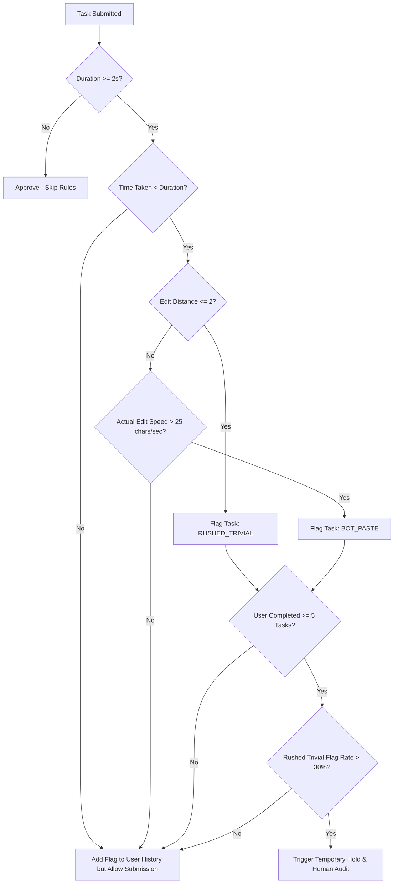

# Engineering Recommendations: Quality Control & Audit System

This document outlines the recommendations and specifications for deploying a real-time anomaly detection system on the **Josh Jobs** transcription platform.

---

## 1. Loophole Rationale
Some transcribers exploit the platform's payment validation system:
* **The Punctuation Bypass**: Instead of reviewing the transcription, users insert a single trailing full-stop (`।` or `.`), space, or comma. This forces `is_edited` to evaluate to `True` (bypassing the "no-edit" flag) while they submit immediately (often within 1.5–2.5 seconds) on 10+ second audio clips.
* **Flawed Core Metric**: The current `segment_character_per_second` is calculated as `len(user_text) / duration` (audio duration) instead of `len(user_text) / time_taken_by_user`. This masks rushing because long clips have low character-to-duration ratios even if submitted instantly.

---

## 2. Updated Automated Validation Flow

To protect high-performing transcribers and minimize false blocks, we implement a **three-tier safety-guarded process**:

### Safety Guard 1: Minimum Sample Size (Cold-Start Rule)
* **Rationale**: Do not auto-block users based on 1 or 2 tasks. Random noise, silent clips, or short audio segment submissions can skew rates.
* **Rule**: Account holds and automated blocks are **only activated** after a user has submitted at least **5 tasks** on the platform. Flags on tasks completed before this threshold are logged in the database but do not trigger actions.

### Safety Guard 2: Temporary Hold instead of Auto-Ban (Appeal Path)
* **Rationale**: Auto-banning accounts based on algorithms leads to poor user retention and community frustration.
* **Rule**: When a user crosses the flag threshold:
  1. Flag the user status as `SUSPENDED_PENDING_AUDIT` (not `BLOCKED`).
  2. Put a temporary hold on payouts.
  3. Route the user's last 5 tasks to the internal **Josh Jobs Quality Assurance Admin Dashboard** for human review.
  4. Provide the user with a transparent message in the app: *"Your account is currently undergoing a routine quality check. Audits are resolved within 24 hours."*
  5. The QA admin can click **Approve** (restoring the account and white-listing the user) or **Ban** (confirming permanent block).

### Safety Guard 3: False Alarm Exceptions for Rule B (Pasting Detection)
* **Rationale**: A typing speed of $>25$ chars/sec is physically impossible for manual transcription but can occur legitimately if:
  1. **Boilerplate Text**: The audio contains a standard repeating advertisement or disclaimer, and the transcriber pastes a pre-saved text block.
  2. **Text-Expansion Tools**: A professional transcriber uses shortcuts (e.g., typing `jkb` which expands to `नमस्कार दोस्तों, जोश टॉक्स में आपका स्वागत है`).
* **Mitigation**:
  * If a text block is pasted, compare it with a database of **common boilerplate scripts** or standard regional greetings. If it matches, exempt it from the `BOT_PASTE` flag.

---

## 3. Platform UX Remediation (Prevention at Source)
Instead of relying solely on reactive auditing, update the platform interface to prevent cheating:
1. **Audio Playback Enforcement**: Disable the "Submit" button until the audio playhead has passed at least **80% of the clip duration**. This makes rushing physically impossible on the interface.
2. **Text Diff Warning**: If the user makes an edit of Levenshtein distance $\le 2$ on a clip longer than 5 seconds, show a modal dialog: *"You made a minimal edit. Please ensure you have listened carefully to spelling and regional dialects before submitting."*
3. **Pasting Interception**: Detect standard keyboard paste shortcuts (Ctrl+V). When detected, trigger a micro-popup asking: *"Pasting detected. Are you using a text expansion tool or submitting boilerplate text?"* and log the event.
