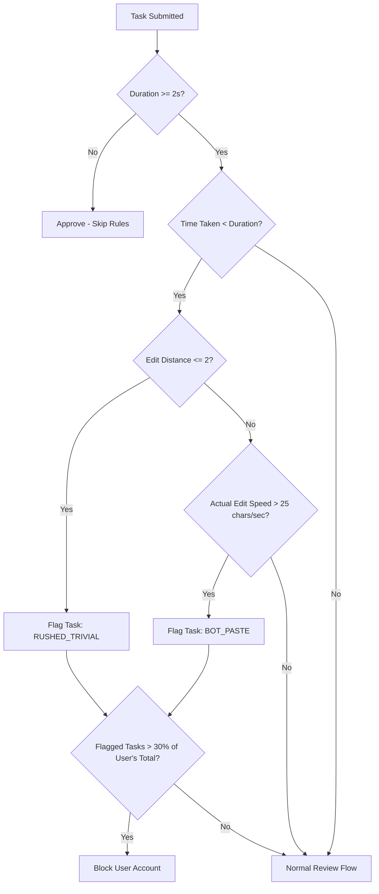

# Engineering Recommendations: Real-Time Fraud & Quality Control System

This document outlines the recommendations and specifications for the engineering team to deploy a real-time anomaly detection system on the **Josh Jobs** transcription platform.

---

## 1. Identified Loophole & Rationale
Some transcribers exploit the platform's payment validation system:
* **The Punctuation Bypass**: Instead of reviewing the transcription, users insert a single trailing full-stop (`।` or `.`), space, or comma. This forces `is_edited` to evaluate to `True` (bypassing the "no-edit" flag) while they submit immediately (often within 1.5–2.5 seconds) on 10+ second audio clips.
* **Flawed Core Metric**: The current `segment_character_per_second` is calculated as `len(user_text) / duration` (audio duration) instead of `len(user_text) / time_taken_by_user`. This masks rushing behaviors because long clips have low character-to-duration ratios even if submitted instantly.

---

## 2. Automated Block Rules

A transcriber should be flagged/blocked if they meet any of the following criteria:

### Rule A: The Rushed Trivial Submission (Punctuation Cheat)
* **Logic**: If the audio clip is longer than 2 seconds, and the user submits in less than the audio's duration with zero or minimal edits (Levenshtein distance <= 2).
* **Metric to Calculate**:
  $$\text{Levenshtein Edit Distance}(WhisperText, UserText) \le 2 \quad \text{AND} \quad TimeTaken < Duration$$
* **Action**: Flag task as fraud. If flag rate exceeds **30%** over the last 10 tasks, automatically block the account.

### Rule B: Suspicious Bot Pasting (Impossibly Fast Substantial Edits)
* **Logic**: If the user makes substantial edits but the actual typing/pasting speed exceeds physical human limits.
* **Metric to Calculate**:
  $$\text{Actual Typing Speed} = \frac{\text{Levenshtein Edit Distance}(WhisperText, UserText)}{TimeTaken} > 25 \text{ chars/second}$$
  *(A typing speed of 25 characters/sec translates to ~300 WPM, which is physically impossible for a human transcribing and listening simultaneously).*
* **Action**: Instant block/suspension of account.

---

## 3. Platform UX Remediation (Prevention at Source)
Instead of relying solely on reactive blocking, the platform UX should prevent low-quality submissions:
1. **Enforced Audio Playback**: Disable the "Submit" button until the audio playhead has passed at least **80% of the clip duration**. This forces the transcriber to listen.
2. **Text Diff Inspector**: Show a warning if the user submits a minor change (e.g., just punctuation or spaces). The system should ask: *"You only added a punctuation mark. Please ensure all regional spelling and grammatical errors are corrected before submitting."*
3. **Typing Activity Logging**: Track actual keystroke events. If the text field changes substantially in a single frame without keypresses (indicating paste), flag for manual audit.
